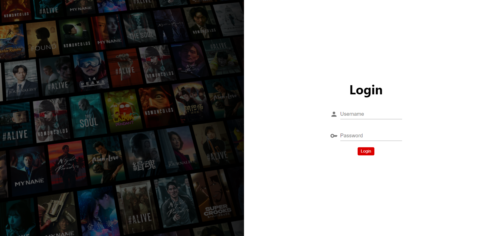
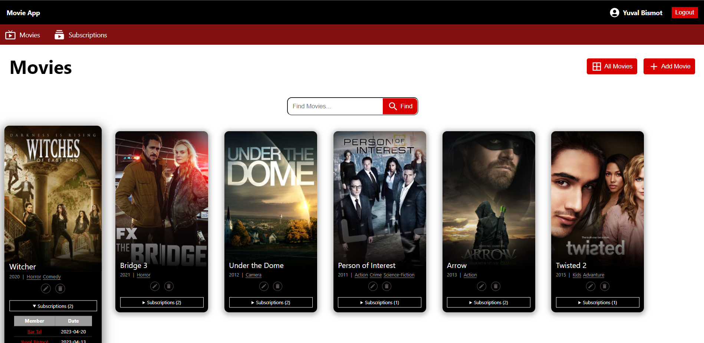
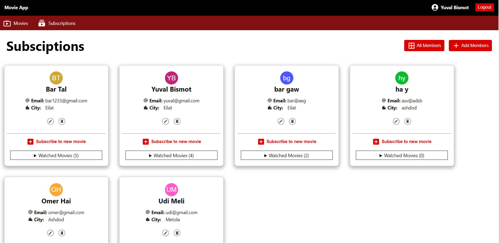

# MovieApp 🍿🎬
Full Stack – Final Project, App for Movies &amp; Subscription management.

<h3>MERN Stack</h3>

<ul>
 <li>Client - React</li>
   <ul>
     <li>axios</li>
     <li>React-Router-Dom</li>
   </ul>
   
 <li>Server - NodeJS</li>
   <ul>
     <li>cors</li>
     <li>express</li>
     <li>jsonwebtoken (JWT)</li>
     <li>mongoose</li>
   </ul>
   
   <li>DataBase - MongoDB</li>
</ul>

<h1>Screenshots of the Site</h1>

<h3>Login Page</h3>

<h3>Movies Page</h3>

<h3>Subsciption Page</h3>

